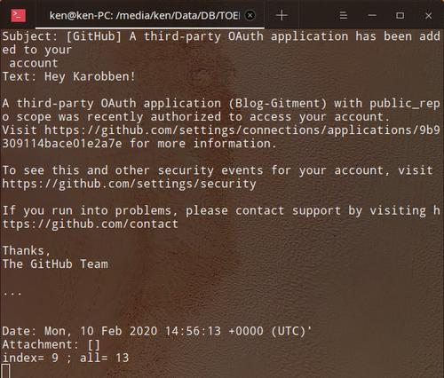

# Python_Pop3_emial

This script is written on python3.7  
It is based on pop3 protocol and the current example is QQmail

who do I build this script:
https://www.yuque.com/liuwenkan/blog/tdg6bo  
reference: https://www.yuque.com/liuwenkan/pwh0c8/qqmail_r  

# Quick Start

Please switch this with your account information in line 182:
```
email = '591465908@qq.com'
password = ''
pop3_server = 'pop.qq.com'
port = 995
```

and:
`python QQmail_recive.py`  

## Hot key:
8: display previous email  
5: display next email  
7: delete this email from local  
9: download attachments  
f/Fresh: fresh the server  
s: save the deleted email from server and fresh.

# Features
Currently, it could receive and delete emails, so you can jump between emails with up(8) and down(5). It could also download attachments. It can decode Chinese and show the mail number in the box.  
Because the Pop server will cut off the connection if there are no requests within a minuet, I have to refresh to keep connection per 55s.

## How to delete and draw back email:
### Delete
> If you want to delete the the email you are reading now, input '7' to delete it locally. If you want to delete it from the server (so as your mailbox), you need to input 's'.  

### Undo delete
> When you input '7' (delete) accidentally, don't panic. It just deleted from the local environment. You can input 'f/Fresh' to reconnect the server and read it again. If you deleted it from server, you can still recover it by signing in the on-line mail box and recalling it from trash can.


## Something will be fixed soon.
A problem is when you deleted the 5th email, you will jump to 4th email automatically. You can check previous email but not 5th, because it is empty. So, you'd like to input 's' to fresh on re-connect the server.

Another problem is each re-fresh will freshen the page. It's extremely nosy when the page fresh each 55s. I'll fix it soon.

Some times, the program dead because of `poplib.error_proto: b'-ERR Message can not load'` .

# requirements:
poplib  
os  
sys  
base64  
email  
signal  


## What can I do:  
Refresh
Receive mails  
Delete emails from local  
Delete emails from server
Download attachments  

## What will I do:  
Stop Refresh the page if there is no update  
Re-Sign in  
Insert to Urwid  
Send and replay e-mail

An example:
<p align='center' >

</p>
